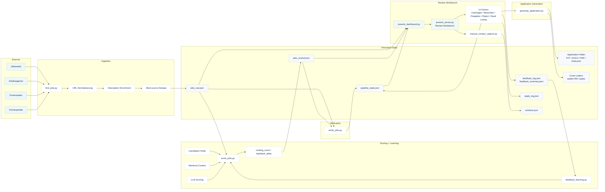

# Architecture

Kompakte Uebersicht ueber die aktive Pipeline.

## Diagramm

## Lesart

- **Sources** liefern Rohfunde aus Jobboards, Arbeitsagentur und Firmenportalen.
- **Ingestion** normalisiert Links, laedt bessere Detailtexte nach und versucht die beste Quelle pro Stelle zu behalten.
- **Scoring + Learning** kombiniert Kandidatenprofil, Retrieval-Kontext, LLM-Bewertung und Feedback-Signale aus frueheren Entscheidungen.
- **Verification** schreibt operative Zustaende in den Pipeline-State.
- **Review Workbench** ist das Arbeitszentrum fuer menschliche Entscheidungen.
- **Application Generation** wird heute bewusst aus der UI heraus pro Job ausgeloest.

## Kernidee

- Discovery ist breit und opportunistisch.
- Verlaesslichkeit entsteht erst durch Quellenbewertung, Enrichment und Review.
- Die Review-UI ist kein Add-on, sondern das operative Zentrum.
- Vollautomation wurde bewusst zugunsten eines robusteren Human-in-the-loop-Flows reduziert.

## Aktive Module

- `source/find_jobs.py`
- `source/score_jobs.py`
- `source/verify_jobs.py`
- `source/present_dashboard.py`
- `source/present_server.py`
- `source/job_actions.py`
- `source/generate_application.py`
- `source/feedback_learning.py`
- `source/candidate_profile.py`

## Persistente Daten

- `source/jobs_raw.json`
- `source/jobs_scored.json`
- `source/pipeline_state.json`
- `source/apply_log.json`
- `source/feedback_log.json`
- `source/feedback_summary.json`
- `source/contacts.json`
