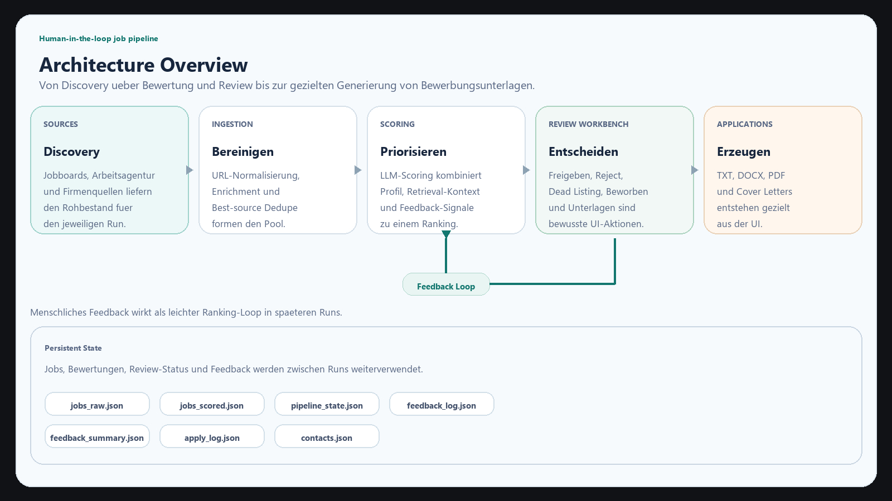
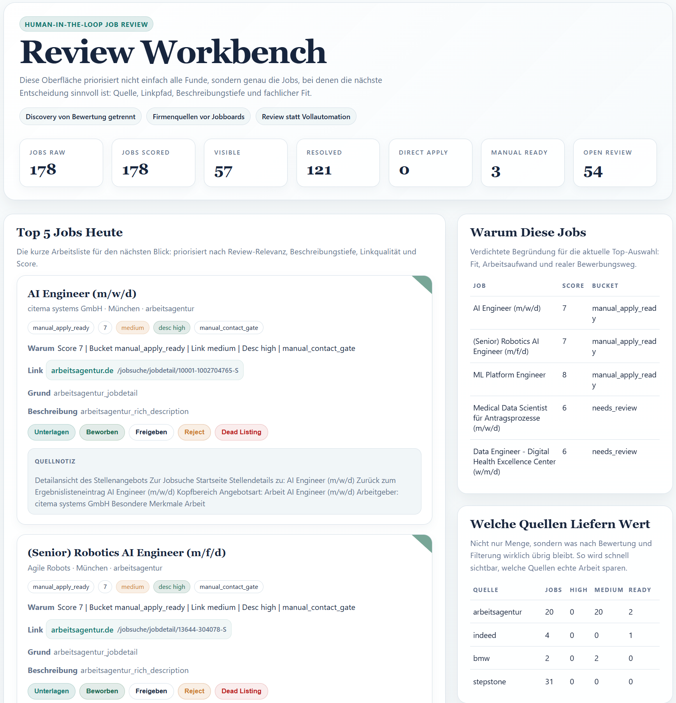
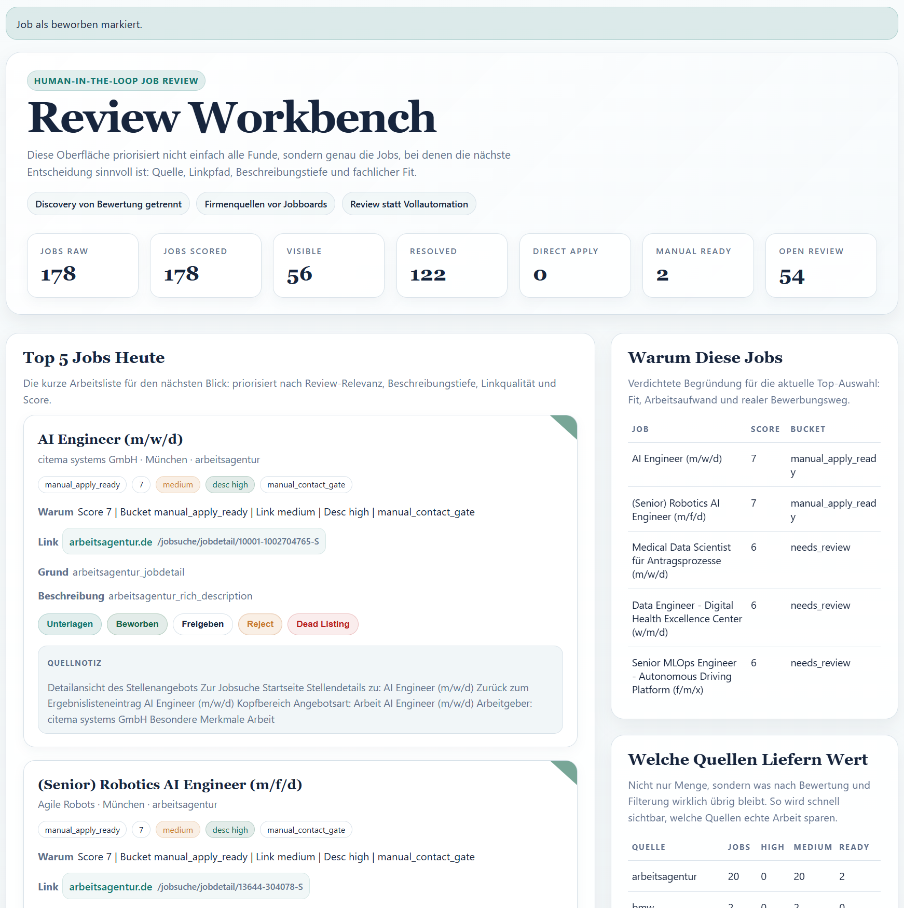
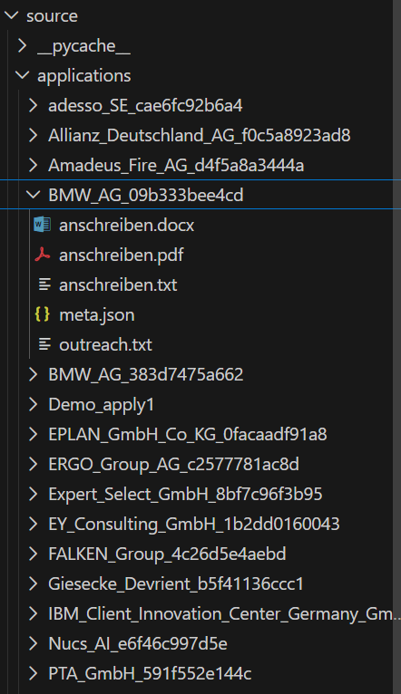

# Job Application Pipeline

Ein praxisnahes Human-in-the-loop-System fuer Jobsuche, Review und Bewerbungsorganisation.

Das Projekt sammelt Stellen aus Jobboards und Firmenportalen, bewertet sie mit einem LLM, priorisiert sie in einer lokalen Review-UI und erzeugt daraus gezielt Bewerbungsunterlagen. Der urspruengliche Vollautomationsgedanke wurde bewusst zu einem realistischeren Modell weiterentwickelt: **Jobboards dienen vor allem als Discovery-Quelle, echte Firmenportale und manuelle Review sind der operative Kern.**

## Problem

Viele Job-Scraping-Projekte brechen an derselben Stelle:

- Jobboards liefern oft nur instabile oder blockierte Links
- echte Bewerbungswege liegen hinter ATS, Firmenportalen oder Captchas
- reine Automatisierung scheitert an Anti-Bot-Massnahmen
- viel Zeit geht fuer manuelle Sichtung und Nachverfolgung verloren

Dieses Projekt adressiert genau diese Luecke:

- Jobs finden
- bessere Quellen von schwachen Quellen trennen
- fachliche Passung mit LLM bewerten
- offene Kandidaten in einer lokalen UI bearbeiten
- Unterlagen nur fuer echte Zielstellen erzeugen

## Projektstory

Das Projekt begann als deutlich automatischerer Bewerbungs-Workflow. In der Praxis zeigte sich aber schnell, dass genau dort die interessanten Probleme liegen:

- Jobboards liefern oft nur schwache Discovery-Links
- echte Bewerbungswege fuehren ueber Firmenportale, ATS oder Captcha-gatete Seiten
- reine Vollautomation ist technisch an einzelnen Stellen moeglich, operativ aber oft die falsche Architektur

Die Antwort darauf war kein groesseres Auto-Apply-System, sondern eine bewusst robustere Pipeline:

- bessere Quellenlogik
- staerkere Trennung von Discovery und Primaerquelle
- LLM-Scoring fuer Priorisierung
- lokale Review-UI als Arbeitsboard
- ein erster echter Feedback-Loop aus menschlichen Entscheidungen

Ein wichtiger Teil dieser Entwicklung war auch, dass fruehere Ideen wie **Auto-Apply** und allgemeines **Outreach als Standardpfad** nicht einfach "fehlten", sondern im Projektverlauf bewusst zurueckgebaut wurden. Sie waren als Experimente nuetzlich, passten aber am Ende nicht zur operativen Realitaet aus Jobboards, ATS, Captchas und instabilen Apply-Links. Der heutige Fokus ist deshalb enger, ehrlicher und robuster.

## Aktueller Fokus

Heute ist das Projekt bewusst **kein blindes Auto-Apply-System** mehr.

Stattdessen:

- **Jobboards** = Discovery
- **Firmenportale / ATS / Captcha-gated Kontakte** = operative Realitaet
- **LLM-Scoring** = Priorisierung, nicht letzte Wahrheit
- **Review Workbench** = Arbeitsboard fuer `Freigeben`, `Reject`, `Dead Listing`, `Beworben` und `Unterlagen`

## Kernfunktionen

- Multi-Source Ingestion fuer:
  - Jobboards
  - Arbeitsagentur
  - direkte Firmenseiten
  - Firmenportale wie Siemens Energy, SWM, Infineon und BMW Group
- URL-Normalisierung und Best-Source-Dedupe
- robusteres Dedupe fuer Firmen- und Titelvarianten wie `BMW Group` vs `BMW AG` oder `ML Ops` vs `MLOps`
- Nachladen reichhaltiger Detailbeschreibungen fuer duenne Funde
- LLM-Scoring mit Kandidatenprofil und Retrieval-Kontext
- Feedback-Loop aus echten Review-Entscheidungen zur spaeteren Ranking-Anpassung
- erste Job-Semantik-Schicht fuer aehnliche Rollen, Duplicate-Hinweise und spaeteres Profil-Matching
- lokale Review-UI mit Statusaktionen und Reject-Grundchips
- getrennte Embedding-Eval-Ansicht fuer manuelle Similarity-Pruefung
- Generierung von Bewerbungsordnern direkt aus der UI
- stabile Cover-Letter-PDFs mit zentralem Ablageort plus lokale Kopie im Bewerbungsordner
- Speicherung manueller Kontakte fuer spaetere Wiederverwendung
- Retrieval-/Embedding-Schicht mit lokalem Vector-Store und optionalen Embedding-Providern

## Architektur



```text
Sources
  -> find_jobs.py
     -> URL normalization
     -> description enrichment
     -> best-source dedupe
     -> jobs_raw.json

jobs_raw.json
  -> score_jobs.py
     -> LLM scoring
     -> feedback delta / ranking score
     -> decision preparation
     -> bucket classification
     -> jobs_scored.json / pipeline_state.json

jobs_raw.json + jobs_scored.json
  -> present_server.py / present_dashboard.py
     -> lokale Review-UI
     -> Freigeben / Reject / Dead Listing / Beworben / Unterlagen

jobs_scored.json
  -> generate_application.py
     -> application folder
     -> txt / docx / pdf assets
```

Eine kompaktere Uebersicht als Diagramm steht in [ARCHITECTURE.md](./ARCHITECTURE.md).

## Beispiel-Workflow

1. Jobs werden aus mehreren Quellen gesammelt.
2. Schwache Discovery-Links und staerkere Primaerquellen werden unterschieden.
3. Duenne Funde werden vor dem Scoring wenn moeglich mit echter Detailbeschreibung angereichert.
4. Das LLM bewertet die fachliche Passung.
5. Feedback aus frueheren Entscheidungen kann die spaetere Sortierung ueber `ranking_score` leicht nachjustieren.
6. Die Review-UI zeigt nur die noch offenen, relevanten Kandidaten.
7. Ueber die UI werden Jobs als:
   - `Beworben`
   - `Reject`
   - `Dead Listing`
   - `Freigegeben`
   markiert.
8. Fuer passende Stellen werden Unterlagen direkt aus der UI erzeugt.

Der operative Kern ist damit heute eher **human-reviewed pipeline** als blinde Vollautomation.

## Showcase: Von Fund zu Bewerbung

Ein konkreter End-to-End-Fall im Projekt war die Stelle:

- `FALKEN Group`
- `Data Engineer - Schwerpunkt AI (m/w/d)`
- Fund ueber Arbeitsagentur

Der Ablauf:

1. Die Stelle kam als Arbeitsagentur-Fund in den Pool.
2. Sie wurde mit Kandidatenprofil und Retrieval-Kontext gescored.
3. Sie erschien in der Review-UI als `needs_review`.
4. Nach manueller Pruefung wurde direkt aus dem System ein Bewerbungsordner erzeugt.
5. Der Ordner enthielt:
   - Anschreiben als TXT
   - DOCX
   - PDF
   - Metadaten

Der Fall zeigt den eigentlichen Kernwert des Projekts:

- Discovery automatisieren
- Priorisierung beschleunigen
- den letzten Bewerbungsschritt bewusst menschlich kontrollieren

## Projektstatus

Das Projekt ist funktional und wird produktiv fuer die eigene Bewerbungsarbeit genutzt.

Bereits vorhanden:

- Ingestion aus mehreren Quellen
- Firmenportal-Schicht
- LLM-Scoring
- Retrieval-/Embedding-Kontext
- Feedback-Loop fuer spaetere Ranking-Signale
- Review-UI
- UI-getriggerte Bewerbungsordner-Generierung
- Status-Tracking
- Kontaktablage fuer manuell gewonnene Kontakte

Noch bewusst nicht perfekt:

- einige Quellen sind weiterhin fragil
- Anti-Bot / Captcha verhindert Vollautomation
- einzelne Datenquellen und Textpfade brauchen noch weiteres Polishing
- manche Jobboards sollten noch konsequenter nur als Discovery behandelt werden
- semantische Job-Aehnlichkeit ist jetzt als erster Layer vorhanden, aber noch bewusst nicht fuer automatisches Merge freigeschaltet

## Quickstart

### 1. Umgebung

```powershell
python -m venv .venv
.\.venv\Scripts\Activate.ps1
pip install -r requirements.txt
```

### 2. Konfiguration

- `.env.example` nach `.env` kopieren
- benoetigte Keys und Pfade eintragen

### 3. Pipeline

```powershell
.\.venv\Scripts\python.exe source\main.py
```

Der Standardlauf geht bis zur lokalen Review-UI:

- `find_jobs`
- `score_jobs`
- `verify_jobs`
- Dashboard-Erzeugung
- Start des lokalen Present-Servers
- Browser-Start auf `http://127.0.0.1:8765`

`--step` ist nur noch fuer gezielte Teilruns gedacht, z. B. Debugging oder schnellere Einzeltests.

### 4. Review-UI separat starten

```powershell
cd source
..\.venv\Scripts\python.exe .\present_server.py
```

Der manuelle UI-Start ist nur noch noetig, wenn du die UI getrennt von `main.py` starten willst.

Dann im Browser:

`http://127.0.0.1:8765`

## Wichtige Dateien

- [find_jobs.py](./source/find_jobs.py)
- [score_jobs.py](./source/score_jobs.py)
- [job_actions.py](./source/job_actions.py)
- [present_server.py](./source/present_server.py)
- [present_dashboard.py](./source/present_dashboard.py)
- [generate_application.py](./source/generate_application.py)
- [feedback_learning.py](./source/feedback_learning.py)
- [PROJECT_STATE.md](./docs/PROJECT_STATE.md)
- [company_search_sources.json](./config/company_search_sources.json)

## Empfohlene Screenshots

Fuer die Portfolio-Fassung eignen sich besonders:

- `screenshots/01_present_ui_overview.png`
- `screenshots/02_review_action_flow.png`
- `screenshots/03_application_assets.png`
- `screenshots/04_reject_window.png`

## Screenshots

### Review Workbench



### Review-Aktion in der UI



### Generierte Bewerbungsunterlagen



## Tech Stack

- Python
- Requests
- BeautifulSoup / lxml
- Selenium
- OpenRouter / LLM scoring
- lokale Web-UI
- lokaler Vector-Store + Embedding-Provider-Unterstuetzung
- JSON-basierter Pipeline-State

## Validation

Typische Checks waehrend der Entwicklung:

```powershell
.\.venv\Scripts\python.exe -m unittest discover tests
.\.venv\Scripts\python.exe -m compileall source
```

Fuer einen realen Produktlauf:

```powershell
.\.venv\Scripts\python.exe source\main.py
```

Der Standardlauf fuehrt bis zur Review-UI und startet anschliessend den lokalen Server im Browser.

## Grenzen

- Keine vollzuverlaessige automatische Bewerbung ueber alle Quellen
- Anti-Bot-Massnahmen und Captcha bleiben reale Grenzen
- Manche Quellen eignen sich nur fuer Discovery, nicht fuer den finalen Apply-Link
- Semantische Embeddings werden derzeit fuer Retrieval-Kontext genutzt, noch nicht fuer echte Job-gegen-Job-Dedupe

Gerade diese Einschraenkungen waren aber zentral fuer die Architekturentwicklung des Projekts.
